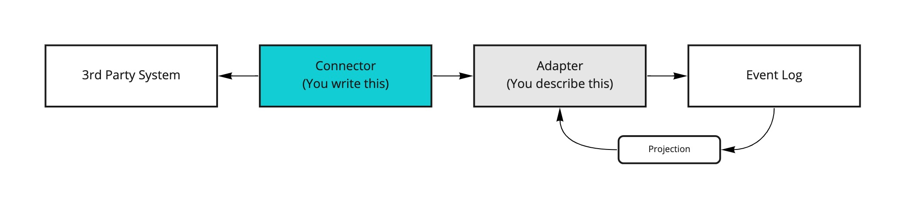
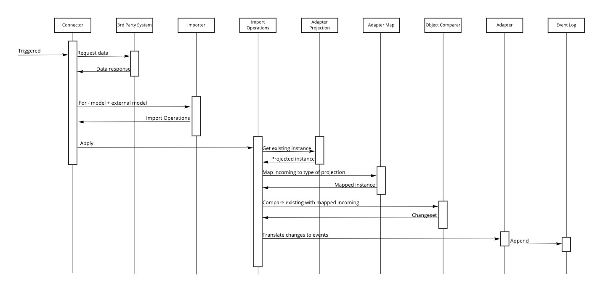

# Integration

Since all we do @ Aksio is Event Sourced, connecting with 3rd parties can become a challenge.
Most 3rd parties don't offer integration where we can ask for domain events that has occurred in a
sequenced manner as we would expect.

The following depicts the high level architecture:



## Adapters

The essential piece of the puzzle is the adapter. Its role is to tell how to translate the external data
from the 3rd party into events. In order for it to do so, it needs to compare with what we already
have with the incoming and then deduce what the changes mean to us in the form of events.

The shape of the incoming data might differ from what we have and its always considered a good practice
to not leverage a 3rd parties construction directly as our representation since it is maintained and belongs
to the third party (read more about [anti-corruption layers](https://docs.microsoft.com/en-us/azure/architecture/patterns/anti-corruption-layer)).
The adapter therefor offers a map of how to map from the incoming type to the type we maintain.

Our type is a projection of the truth as we know it which are represented as events. The adapter defines
a way to project from the event log to a type we call the model.

With the two instances; the external model and our model - both now with the same shape, we can perform
a comparison. From the comparison, you define what events should be produced based on for instance which
properties have changed.

The following describes the flow in more detail:



## Getting started

### Models

Lets start my defining the models we have; the external model and our internal model.

The external model could be something like below (PS: our sample shows an imaginary Norwegian external model):

```csharp
public record KontoEier(string Fnr, string Fornavn, string Etternavn, DateTime FodselsDato, string Adresse, string By, string PostNr, string Land);
```

> Note: The external model might already be something that is coming from the 3rd party as a library or other and you
> wouldn't then need to create this.

For our internal model we want to represent that differently, in English:

```chsarp
public record AccountHolder(string FirstName, string LastName, DateTime DateOfBirth, string SocialSecurityNumber, string Address, string City, string PostalCode, string Country);
```

### Identification

In order for the integration engine to work with the instances, it needs to know what property on the external model
represents the key. This key will be used as the event source id/key when applying any events and is also what
we query the event log for based on this key to project into a model instance for comparison.

```csharp
public class AccountHolderDetailsAdapter : AdapterFor<AccountHolder, KontoEier>
{
    public override Func<KontoEier, EventSourceId> KeyResolver => _ => _.Fnr;
}
```

> Note: Since the property for resolving the key is a `Func` callback, you can do complex key resolution from any of the
> properties within the external model. E.g. composite keys. As long as it can be a string - which the `EventSourceId`
> is the concept of.

### Model Projection

To get to a comparable state we leverage projections. The projections are as any other projections in
Aksio and leverages the projection engine found in [Cratis](https://github.com/cratis/cratis).
Its job is to describe how we go from events to a single model instance.
The projection setup for integration is slightly different than for regular projections, as we're
working concretely on instances.

```csharp
public class AccountHolderDetailsAdapter : AdapterFor<AccountHolder, KontoEier>
{
    public override Func<KontoEier, EventSourceId> KeyResolver => _ => _.Fnr;

    public override void DefineModel(IProjectionBuilderFor<AccountHolder> builder) => builder
        .From<AccountHolderRegistered>(_ => _
            .Set(m => m.FirstName).To(ev => ev.FirstName)
            .Set(m => m.LastName).To(ev => ev.LastName)
            .Set(m => m.DateOfBirth).To(ev => ev.DateOfBirth))
        .From<AccountHolderAddressChanged>(_ => _
            .Set(m => m.Address).To(ev => ev.Address)
            .Set(m => m.City).To(ev => ev.City)
            .Set(m => m.PostalCode).To(ev => ev.PostalCode)
            .Set(m => m.Country).To(ev => ev.Country));
}
```

### External Model to Model mapping

Since the shape of the external model is likely to be different from our representation, we need
to be able to map properties across to get the external model represented in the same shape
as our model is. This is done by overriding the `DefineImportMapping` method of the adapter.
The mapping engine that is used is [Automapper](https://automapper.org).

```csharp
public class AccountHolderDetailsAdapter : AdapterFor<AccountHolder, KontoEier>
{
    public override Func<KontoEier, EventSourceId> KeyResolver => _ => _.Fnr;

    public override void DefineImportMapping(IMappingExpression<KontoEier, AccountHolder> builder) => builder
        .ForMember(_ => _.SocialSecurityNumber, _ => _.MapFrom(_ => _.Fnr))
        .ForMember(_ => _.FirstName, _ => _.MapFrom(_ => _.Fornavn))
        .ForMember(_ => _.LastName, _ => _.MapFrom(_ => _.Etternavn))
        .ForMember(_ => _.DateOfBirth, _ => _.MapFrom(_ => _.FodselsDato))
        .ForMember(_ => _.Address, _ => _.MapFrom(_ => _.Adresse))
        .ForMember(_ => _.City, _ => _.MapFrom(_ => _.By))
        .ForMember(_ => _.Country, _ => _.MapFrom(_ => _.Land));
}
```

### Import Definition

The last piece of the puzzle is to tell the integration engine what to do with the differences
found when doing comparison. This is done by overriding the `DefineImport` method.
It gives you a builder to work with, which is essentially a reactive [Subject](https://docs.microsoft.com/en-us/previous-versions/dotnet/reactive-extensions/hh229173(v=vs.103))
with the context object created vby the engine. With this you can create your own conditionals
using the [reactive API](https://github.com/dotnet/reactive).
To append events there are extension methods for the `IObservable` that gives you that possibility.

```csharp
public class AccountHolderDetailsAdapter : AdapterFor<AccountHolder, KontoEier>
{
    public override Func<KontoEier, EventSourceId> KeyResolver => _ => _.Fnr;

    public override void DefineImport(IImportBuilderFor<AccountHolder, KontoEier> builder)
    {
        builder
            .WithProperties(_ => _.FirstName, _ => _.LastName, _ => _.DateOfBirth)
            .AppendEvent(_ => new AccountHolderRegistered(_.Changeset.Incoming.FirstName, _.Changeset.Incoming.LastName, _.Changeset.Incoming.DateOfBirth))

        builder
            .WithProperties(_ => _.Address, _ => _.City, _ => _.PostalCode)
            .AppendEvent<AccountHolder, KontoEier, AccountHolderAddressChanged>();
    }
}
```

> Note: There are multiple overloads of `AppendEvent`. One with a callback for creating the event and one without a callback.
> The latter will then match properties by convention from the model type to the event type and copy the content over.
> With the callback you have full flexibility of how you create the event and maybe there is a last minute
> condition for selecting which event to append.

### All together

Putting it all together you'll get an adapter like below.

```csharp
public class AccountHolderDetailsAdapter : AdapterFor<AccountHolder, KontoEier>
{
    public override Func<KontoEier, EventSourceId> KeyResolver => _ => _.Fnr;

    public override void DefineModel(IProjectionBuilderFor<AccountHolder> builder) => builder
        .From<AccountHolderRegistered>(_ => _
            .Set(m => m.FirstName).To(ev => ev.FirstName)
            .Set(m => m.LastName).To(ev => ev.LastName)
            .Set(m => m.DateOfBirth).To(ev => ev.DateOfBirth))
        .From<AccountHolderAddressChanged>(_ => _
            .Set(m => m.Address).To(ev => ev.Address)
            .Set(m => m.City).To(ev => ev.City)
            .Set(m => m.PostalCode).To(ev => ev.PostalCode)
            .Set(m => m.Country).To(ev => ev.Country));

    public override void DefineImportMapping(IMappingExpression<KontoEier, AccountHolder> builder) => builder
        .ForMember(_ => _.SocialSecurityNumber, _ => _.MapFrom(_ => _.Fnr))
        .ForMember(_ => _.FirstName, _ => _.MapFrom(_ => _.Fornavn))
        .ForMember(_ => _.LastName, _ => _.MapFrom(_ => _.Etternavn))
        .ForMember(_ => _.DateOfBirth, _ => _.MapFrom(_ => _.FodselsDato))
        .ForMember(_ => _.Address, _ => _.MapFrom(_ => _.Adresse))
        .ForMember(_ => _.City, _ => _.MapFrom(_ => _.By))
        .ForMember(_ => _.Country, _ => _.MapFrom(_ => _.Land));

    public override void DefineImport(IImportBuilderFor<AccountHolder, KontoEier> builder)
    {
        builder
            .WithProperties(_ => _.FirstName, _ => _.LastName, _ => _.DateOfBirth)
            .AppendEvent(_ => new AccountHolderRegistered(_.Changeset.Incoming.FirstName, _.Changeset.Incoming.LastName, _.Changeset.Incoming.DateOfBirth))

        builder
            .WithProperties(_ => _.Address, _ => _.City, _ => _.PostalCode)
            .AppendEvent<AccountHolder, KontoEier, AccountHolderAddressChanged>();
    }
}
```

### Triggering integration

What triggers an integration flow is whatever you want it to be, for instance an ASP.NET controller action could
be such an entrypoint.
